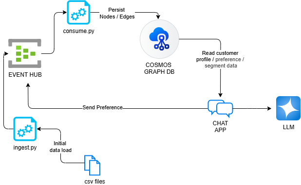
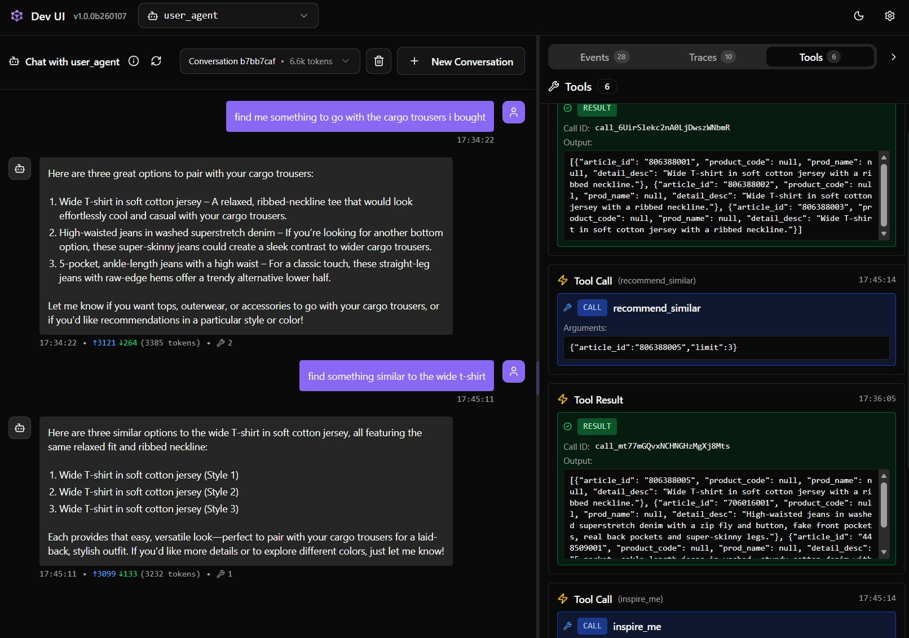

# Graph Chat
This hack explores:
- Populating vertices and edges in a Graph database from an event source
- Using that Graph to power a more personalised LLM assistant, using Microsoft Agent Framework
- Extracting preferences from the user chat and persisting them back to the graph for future usage.

It makes use of the anonymised H&M dataset, available on Kaggle.

## Agents
- `user_agent`: 
  - Looks up user purchses from the graph
  - Recommends items based on customer segment queries
  - Finds similar items to existing ones
  - Calls preference extraction as an agent inside a memory layer

- `dynamic_query_agent`:
  - Experiment to test handing the agent the [graph schema](./docs/graph-schema.md) and a user query, and dynamically generating a gremlin query. Not safe, there be dragons here :)

- `signals_extraction_agent`:
  - Pass the conversation to this agent along with a model schema for `preferences`, and have it extract those customer preferences from the chat.

## High Level Architecture


## Usage
In the super handy Dev UI extension for Agent Framework:




## Directory Structure

```
├── infra/                 # Terraform infrastructure definitions
├── src/
│   ├── agents/            # Agents, tools & memory
│   └── ingestion/         # Data pipeline
│       ├── ingest/        # CSV → Event Hub producer
│       ├── consume/       # Event Hub consumer → Cosmos DB
│       └── models/        # Event data models
└── tests/                 # Unit, integration and ai evals
```

## Getting Started

1. **Clone the repository**
    ```bash
    git clone https://github.com/damoodamoo/graph_chat.git
    cd graph_chat
    ```

2. **Open in dev container**
    - Open the project in VS Code
    - When prompted, click "Reopen in Container"
    - Or use Command Palette: `Dev Containers: Reopen in Container`

3. **Authenticate with Azure**
    ```bash
    az login
    ```

4. **Configure environment variables**
    - Create a `.env` file in the project root
    - Add required configuration (see `.env.example` if available)

5. **Deploy infrastructure**
    ```bash
    task infra:deploy
    ```

    Deploying the infra creates the `app.env` file that the ingestion and chat agents need.

6. **Download and reduce the source data from Kaggle**
    - Get a Kaggle API key and set it in .env
    ```bash
    task data:download
    ```

    Now you have the full and reduced dataset downloaded.

7. **Run the 'ingest' and 'consume' flows** to populate the graph.
    In one terminal session, start the consumer: 
    ```bash
    task consume:all
    ```

    In another session, start the ingest (producer):
    ```bash
    task ingest:all
    ```

8. **Run the agent**
    ```
    task agent:dev
    ```

    ...ask it some stuff.

9. **Run the evals**
    Currently there is one set of evals for preference extraction.
    ```
    task eval
    ```

    Other unit / integration tests are under `task test`.

---

*This is an experimental project and is intended for upskilling.*